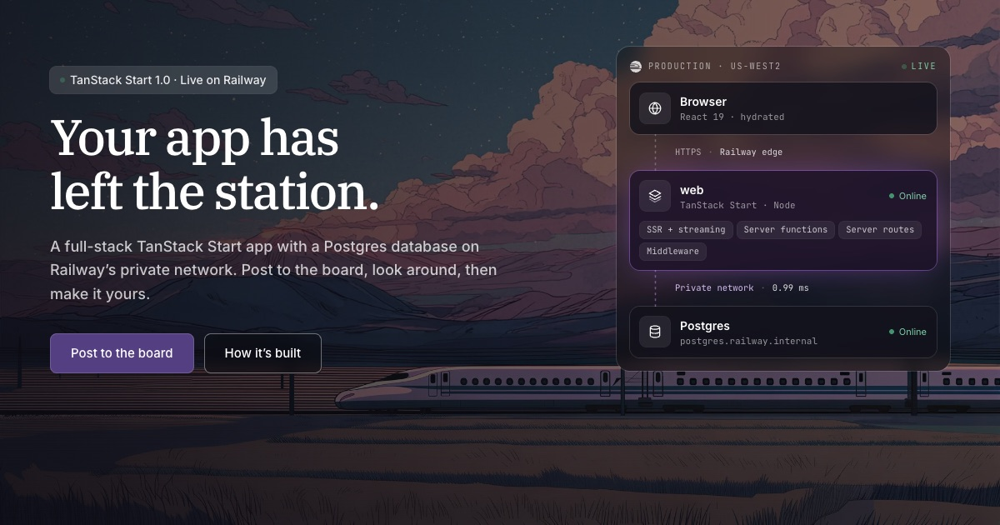
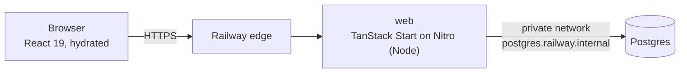

# TanStack Start on Railway

[](https://railway.com/new/template/u3A7Mz?utm_medium=integration&utm_source=button&utm_campaign=tanstack-start)

A full-stack [TanStack Start](https://tanstack.com/start) app with Postgres that shows the core features of Start 1.0, deployed on [Railway](https://railway.com).

The demo is **Departures**, a split-flap train-station board. Visitors post a short message and a destination, and it appears on the board. The app is small enough to read in one sitting, but it does what real apps do: reads and writes a database, validates input, keeps a session, streams slow data, exposes an API, and deploys with migrations and health checks.

**Live demo:** https://web-production-f431e.up.railway.app



## Contents

- [Quick start](#quick-start)
- [What it demonstrates](#what-it-demonstrates)
- [How it fits together](#how-it-fits-together)
- [Deploying on Railway](#deploying-on-railway)
- [Developing locally](#developing-locally)
- [Project structure](#project-structure)
- [Making it your own](#making-it-your-own)
- [Notes for maintainers](#notes-for-maintainers)

## Quick start

**Deploy:** click **Deploy on Railway** above. It creates the app and a Postgres database, runs the migrations, and gives you a URL.

**Run locally** (Node 22.12+, pnpm, Docker):

```bash
pnpm install
cp .env.example .env
pnpm db:up        # Postgres in Docker
pnpm db:migrate   # create tables and seed the board
pnpm dev          # http://localhost:3000
```

## What it demonstrates

Each feature is used for a real job in the app, not as an isolated demo. The `/features` page in the running app walks through each one with its code.

| Feature | How the app uses it | Source |
| --- | --- | --- |
| **Server functions** | `createServerFn` with zod `.validator()` to create, list, read and delete departures. The client bundle gets an RPC stub instead of the handler. | [`src/server/departures.ts`](src/server/departures.ts) |
| **Type-safe routing** | File-based routes. The `$id` path param is parsed to a number in the route definition, so it's typed everywhere it's used. | [`src/routes/board.$id.tsx`](src/routes/board.$id.tsx) |
| **Validated search params** | The `?dest=Tokyo&page=2` filter and pagination are validated with a zod schema and typed in every `Link`. | [`src/routes/board.index.tsx`](src/routes/board.index.tsx) |
| **TanStack Query + SSR** | Loaders prefetch with `queryClient.query()`; `setupRouterSsrQueryIntegration` passes the data from server to browser. Posting uses an optimistic mutation with rollback. | [`src/router.tsx`](src/router.tsx), [`src/lib/queries.ts`](src/lib/queries.ts), [`src/components/PostForm.tsx`](src/components/PostForm.tsx) |
| **Streaming SSR** | The stats loader awaits a fast query and returns slow ones as unawaited promises. They stream into the same response and fill in through `<Await>`. | [`src/routes/stats.tsx`](src/routes/stats.tsx) |
| **Selective SSR** | The full-screen kiosk board is `ssr: 'data-only'`. Its loader runs on the server, and the component renders in the browser because it needs the window size and the Fullscreen API. | [`src/routes/board.live.tsx`](src/routes/board.live.tsx) |
| **Server routes** | `server.handlers` for a public JSON API (with `Cache-Control`) and the health check Railway uses during deploys. | [`src/routes/api/`](src/routes/api) |
| **Middleware** | Global request middleware adds `Server-Timing` and region headers. Global function middleware logs each server function call. CSRF protection is registered explicitly. | [`src/start.ts`](src/start.ts), [`src/server/middleware.ts`](src/server/middleware.ts) |
| **Sessions** | `useSession` keeps an encrypted cookie holding an anonymous visitor id, so people can delete their own posts without logging in. | [`src/server/session.server.ts`](src/server/session.server.ts) |
| **Server-only code** | `*.server.ts` modules (database, session, moderation) are blocked from the client bundle by import protection. `createServerOnlyFn` guards reads of Railway's environment variables. | [`src/server/db.server.ts`](src/server/db.server.ts), [`src/lib/railway.ts`](src/lib/railway.ts) |
| **Head, errors, not-found** | Per-route `head()` built from loader data. `notFound()` thrown from a server function renders the route's `notFoundComponent`. | [`src/routes/board.$id.tsx`](src/routes/board.$id.tsx), [`src/routes/__root.tsx`](src/routes/__root.tsx) |
| **Hydration-aware rendering** | `useHydrated()` shows times in UTC on the server and switches to local time after hydration, with no mismatch. | [`src/components/DepartureBoard.tsx`](src/components/DepartureBoard.tsx) |
| **Static prerendering** | `/features` has no request-time data, so it's rendered to HTML at build time and served as a static file. | [`vite.config.ts`](vite.config.ts) |

### Pages

| Route | What it is | Rendering |
| --- | --- | --- |
| `/` | Hero with a live architecture diagram, feature grid, board preview, infra card | SSR, data prefetched into Query |
| `/board` | Full board with destination filter, pagination and post form | SSR, validated search params |
| `/board/:id` | A "boarding pass" for one departure; delete it if it's yours | SSR, per-page meta, `notFound()` |
| `/board/live` | Kiosk board that refreshes every 5 seconds | `ssr: 'data-only'` |
| `/stats` | Totals, plus slow panels that stream in | Streaming SSR |
| `/features` | A walkthrough of each feature with code | Prerendered at build time |
| `/api/departures` | Public JSON: `?dest=Tokyo&limit=20` | Server route |
| `/api/health` | Returns 503 if the database is unreachable | Server route |

## How it fits together



- **One Node server.** `vite build` with the `nitro()` plugin produces a self-contained server in `.output/`, and Railway runs it with `node .output/server/index.mjs`. Because the server is long-running, the database connection pool, the in-memory rate limiter and streaming responses work just as they do locally.
- **Data flow.** Route loaders call `queryClient.query()` with shared [query options](src/lib/queries.ts). On the first request this runs on the server and the results are passed to the browser with the page. Components read with `useSuspenseQuery`, so they never wait on first render. Mutations go through server functions and invalidate the affected queries.
- **One `QueryClient` per request.** It's created inside `getRouter()`, as the TanStack docs recommend, so the server never shares cached data between visitors.
- **Database access lives in `*.server.ts` modules.** Server functions import them. Start strips the handler bodies, and those imports, from the client bundle, and import protection fails the build if a `.server.ts` file is ever imported from client code.

## Deploying on Railway

The template provisions two services:

| Service | Configuration |
| --- | --- |
| **web** (this repo) | Build: Railpack (`pnpm build`)<br>Start: `node .output/server/index.mjs`<br>Pre-deploy: `node scripts/migrate.mjs`<br>Health check: `/api/health` (60s timeout)<br>A generated public domain |
| **Postgres** | Railway Postgres |

### What happens on each deploy

1. **Build.** Railpack installs dependencies with pnpm (the version comes from `packageManager`, Node from `engines`) and runs `pnpm build`.
2. **Pre-deploy.** [`scripts/migrate.mjs`](scripts/migrate.mjs) waits for Postgres to accept connections, applies the Drizzle migrations in `drizzle/`, and seeds the board if it's empty. If it fails, the deploy stops and the previous version keeps serving.
3. **Health check.** The new deployment receives traffic only after `/api/health` returns 2xx. That endpoint runs `select 1`, so a build that can't reach its database never replaces a working one. Railway checks it during deploys only, not continuously.

### Environment variables

| Variable | Set by | Purpose |
| --- | --- | --- |
| `DATABASE_URL` | Template: `${{Postgres.DATABASE_URL}}` | Connection string over the private network |
| `SESSION_SECRET` | Template: `${{secret(32)}}` | Encrypts the session cookie (32+ characters) |
| `RAILWAY_*` | Railway | Shown on the infra card: region, deployment, replica, service, environment, and commit for GitHub deploys ([reference](https://docs.railway.com/variables/reference#railway-provided-variables)) |

### Infrastructure as code

[`.railway/railway.ts`](.railway/railway.ts) describes the same two services using Railway's [infrastructure as code](https://docs.railway.com/infrastructure-as-code). Railway doesn't read the file during deploys; you apply it with the CLI:

```bash
railway config plan    # preview changes against the linked project
railway config apply   # apply them
```

The older `railway.json` Config as Code is deprecated, and new services ignore it, so this template doesn't ship one.

### Optional

- **CDN.** `/api/departures` sends `Cache-Control: public, s-maxage=10, stale-while-revalidate=30`. Railway's CDN is off by default; run `railway cdn enable` to cache those responses at the edge.
- **Preview environments.** Turn on PR environments in project settings to get a full copy, database included, for each pull request.

## Developing locally

You need Node 22.12+ and pnpm. Docker is optional: without it, point `DATABASE_URL` in `.env` at any Postgres.

| Script | What it does |
| --- | --- |
| `pnpm dev` | Vite dev server on http://localhost:3000 |
| `pnpm build` | Production build to `.output/`, including the prerendered `/features` |
| `pnpm start` | Run the production server (reads `PORT`, default 3000) |
| `pnpm typecheck` | TypeScript checks |
| `pnpm db:up` | Start Postgres in Docker ([`docker-compose.yml`](docker-compose.yml)) |
| `pnpm db:generate` | Generate a migration after editing [`src/server/schema.ts`](src/server/schema.ts) |
| `pnpm db:migrate` | Apply migrations and seed an empty board |
| `pnpm db:studio` | Open Drizzle Studio |

**Using the Railway database from your machine.** Railway's `DATABASE_URL` points at `postgres.railway.internal`, which only resolves inside Railway. Run `railway link`, then `railway connect Postgres` for a `psql` shell, or `railway connect Postgres --tunnel-only` for a local port your tools can use.

## Project structure

```
.
├── .railway/railway.ts          Railway infrastructure as code
├── .railway/template-overview.md  the template's marketplace overview
├── drizzle/                     generated SQL migrations (committed)
├── scripts/migrate.mjs          pre-deploy: wait for Postgres, migrate, seed
├── public/                      static assets, hero images, og.jpg
├── vite.config.ts               tanstackStart() + nitro() (+ prerender)
└── src/
    ├── start.ts                 global middleware (CSRF, timing, logging)
    ├── router.tsx               router + per-request QueryClient + SSR query integration
    ├── routes/
    │   ├── __root.tsx           document shell, <head>, fonts, theme
    │   ├── index.tsx            /
    │   ├── board.index.tsx      /board
    │   ├── board.$id.tsx        /board/:id
    │   ├── board.live.tsx       /board/live  (ssr: 'data-only')
    │   ├── stats.tsx            /stats       (streaming)
    │   ├── features.tsx         /features    (prerendered)
    │   └── api/                 /api/health, /api/departures
    ├── server/
    │   ├── departures.ts        server functions (client-importable)
    │   ├── infra.ts             server function behind the infra card and diagram
    │   ├── stats.ts             server functions for /stats
    │   ├── middleware.ts        request + function middleware
    │   ├── schema.ts            Drizzle schema
    │   ├── db.server.ts         Postgres pool (server-only)
    │   ├── session.server.ts    useSession (server-only)
    │   └── moderation.server.ts rate limiting, link filter (server-only)
    ├── lib/                     shared: zod schemas, query options, site config, Railway env
    ├── components/              board, split-flap, infra card, hero diagram, chrome
    └── styles/app.css           Tailwind v4 theme built on Railway's brand tokens
```

## Making it your own

- **Branding.** Colors are CSS variables at the top of [`src/styles/app.css`](src/styles/app.css), mapped into Tailwind with `@theme`. The site name and links are in [`src/lib/site.ts`](src/lib/site.ts).
- **Schema changes.** Edit [`src/server/schema.ts`](src/server/schema.ts), run `pnpm db:generate`, and commit the new file in `drizzle/`. The next deploy applies it before traffic switches.
- **Remove the demo.** Delete `src/routes/board*`, `src/routes/stats.tsx`, and the departures and stats code in `src/server/`. Keep `__root.tsx`, `router.tsx`, `start.ts`, `api/health.ts` and `db.server.ts`.
- **Remove the simulated latency.** `simulateSlowQuery` in [`src/server/stats.ts`](src/server/stats.ts) only exists so you can see streaming happen.
- **Scaling out.** The rate limiter keeps its counts in memory, so each replica counts separately. Move it to Redis if you need a shared limit. It identifies clients by `X-Real-IP`, which Railway's edge sets to the client's address.

## Notes for maintainers

- **Version floor.** `@tanstack/react-start` is `^1.168.60`, the first release with the fix for CVE-2026-102989. On 1.0 release day, bump `@tanstack/react-start`, `@tanstack/react-router`, `@tanstack/react-router-devtools` and `@tanstack/react-router-ssr-query` together.
- **Prerendering goes through Nitro.** With `tanstackStart({ prerender })` plus `nitro()`, Start writes the prerendered HTML after Nitro has sealed its public-asset manifest, so the page is never served statically ([TanStack/router#7473](https://github.com/TanStack/router/issues/7473)). This template uses `nitro({ prerender: { routes: ['/features'] } })` instead. Switch back to the Start option once that issue is fixed.
- **Nitro is pinned** to an exact v3 beta (`3.0.260903-beta`) because the `nitro/vite` plugin is still under active development.
- **CSRF is explicit.** Defining `src/start.ts` replaces Start's default CSRF middleware, so [`src/start.ts`](src/start.ts) registers `createCsrfMiddleware({ filter: ctx => ctx.handlerType === 'serverFn' })`. It works behind Railway's proxy as-is, with no `origin` override needed.
- **Server function files.** Wrappers live in `src/server/*.ts`, and server-only helpers in `*.server.ts`. The docs also suggest a `*.functions.ts` naming convention; either works.
- **Stack.** React 19, Vite 8, Nitro 3 (beta), Tailwind CSS 4, TanStack Query 5, Drizzle ORM with `postgres.js`, zod 4, TypeScript 7.
